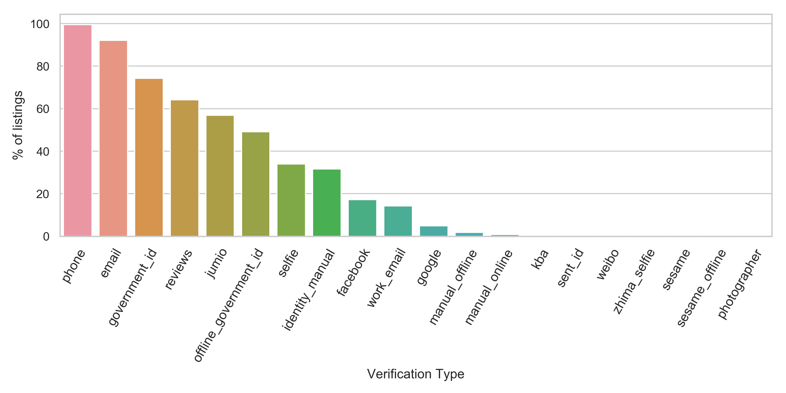
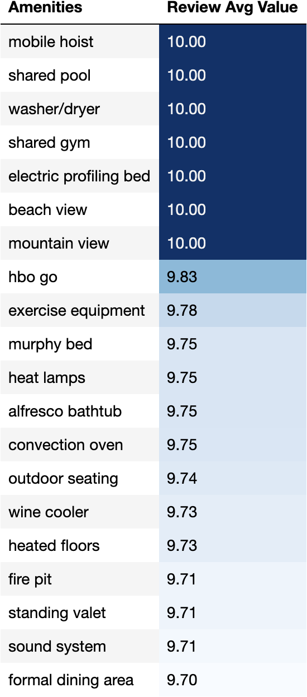
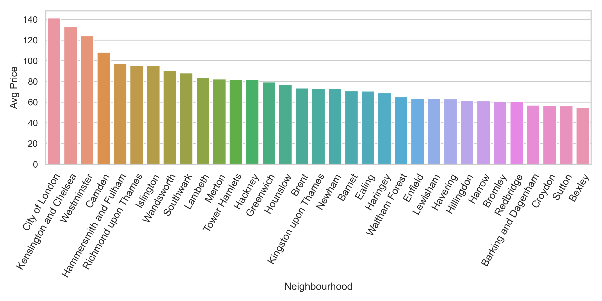

# **Advice to people thinking of advertising a property on Airbnb**
As Airbnb has become increasingly popular, so I wanted to investigate the underlying data around the listings of the different properties and try to answer certain questions that could benefit both Airbnb and the owner. I decided to look at the investigation from a certain point of view, I wanted to see if there was anything that could help the potential owners in deciding whether to list their property or not. I wanted to select the most recent listings within 2020, even with the current situation facing London.

## **What types of verifications are hosts using? How long did it take them to respond?**
The first question I wanted to investigate was to do with the verifications of the guests, this would be the process of confirming the identities of who would be renting the property.

## **What types of amenities are hosts using? would they give a good review score?**

## **Deciding on an acceptable price**
My initial thoughts were to asks questions from a view of potentially renting a property/room. What is the average price for the different location? What types of verifications are hosts using? How long did it take them to respond? What features assist in predicting a price for any listing?

The first step that I took was to visualise the data from an a view on the London boroughs, was there any areas within london that were the most expensive? or was there more evenly spread of the prices.

When initial viewing the London map, it shows that the majority of the prices that range from £111 to £223 are with the central/west which would presume that the borough of Westminster would be one of the most expensive. The lower prices have an evenly spread through out London which would confirm that these properties would be more affordable.   

Looking at the average price for the different boroughs shows that the City of London, Kensington and Chelsea, and also Westminster are the top 3 boroughs with the largest average price.

## **Would it possible to predict the price from the different property features?**
With the data I wanted to see if there was a way of predicting a price, was there a machine learning model that could help? What features would assist in predicting a price for any listing?

## **Place holder for the machine learning model findings**
Thinking of feature selection

## **Conclusion**
