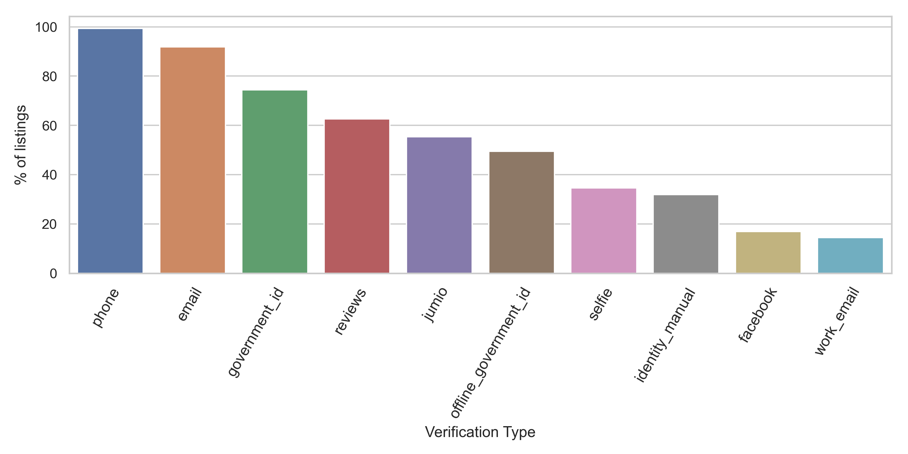
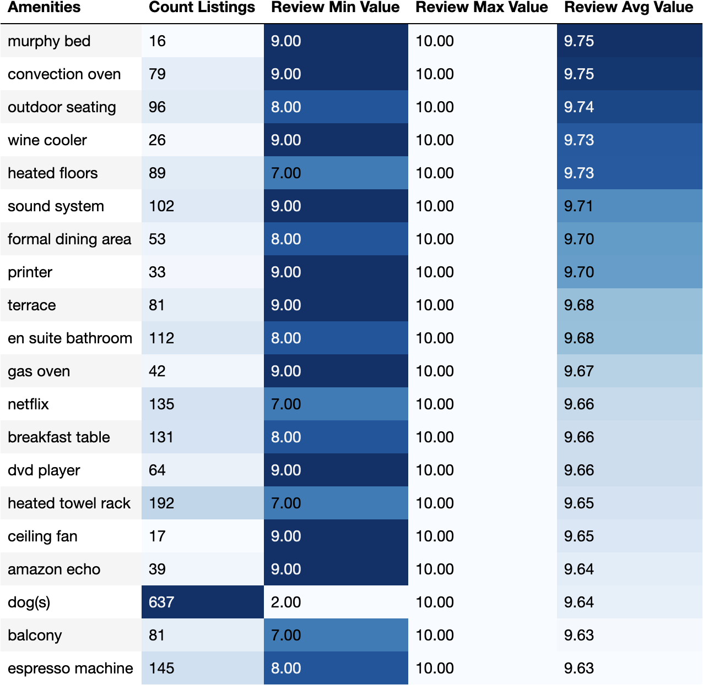

# **Advice to people thinking of advertising a property on Airbnb**
As Airbnb has become increasingly popular, I wanted to investigate the underlying data around the listings of the different properties within London and try to answer certain questions that could benefit both Airbnb and potential owners. I decided to look at the investigation from a certain point of view, I wanted to see if there was anything that could help the property owners in deciding whether to list their property and what could help in getting the best possible price. I wanted to select the most recent listings within 2020, even with the current situation facing London.

## **What types of verifications are hosts using?**
Looking at the types verifications I want to see what the different types were and how many were associated with the listings. The data seems to show that phone calls, emails and government id were the top 3. About 70% of the listings had government id as one of the verifications and in my mind that would be a suitable, especially if your letting someone into your property that you do not know.

## **Which types of amenities are hosts using? Would they give a good review score?**
Now with amenities these are the items that you would hope would make a guest enjoy their stay and in turn give you an outstanding review. The table below shows the amenities by the count of listings where the word was seen and then the min, max and average review value. The top 20 amenities seem to show that luxuries certainly does help with the average review and having the option for allowing pets i.e. dogs also helps.

## **What could possibly an acceptable price?**
My first thoughts with the price was to look at the data from a view of the London boroughs, was there any areas within london that were the most expensive? or was there more evenly spread of the prices.

When initially viewing the London map, it shows that the majority of the prices that range from £111 to £223 are with the central/west which would presume that the borough of Westminster would be one of the most expensive. The lower prices have an evenly spread through out London which would confirm that these properties would be more affordable.   

Looking at the average price for the different boroughs shows that the City of London, Kensington and Chelsea, and also Westminster are the top 3 boroughs with the largest average price.

## **Would it possible to predict the price from the different property features?**
With the data I wanted to see if there was a way of predicting a price, was there a machine learning model that could help? What features would assist in predicting a price for any listing?

## **What could be the most important to the price?**
Thinking of feature selection

## **Conclusion**
